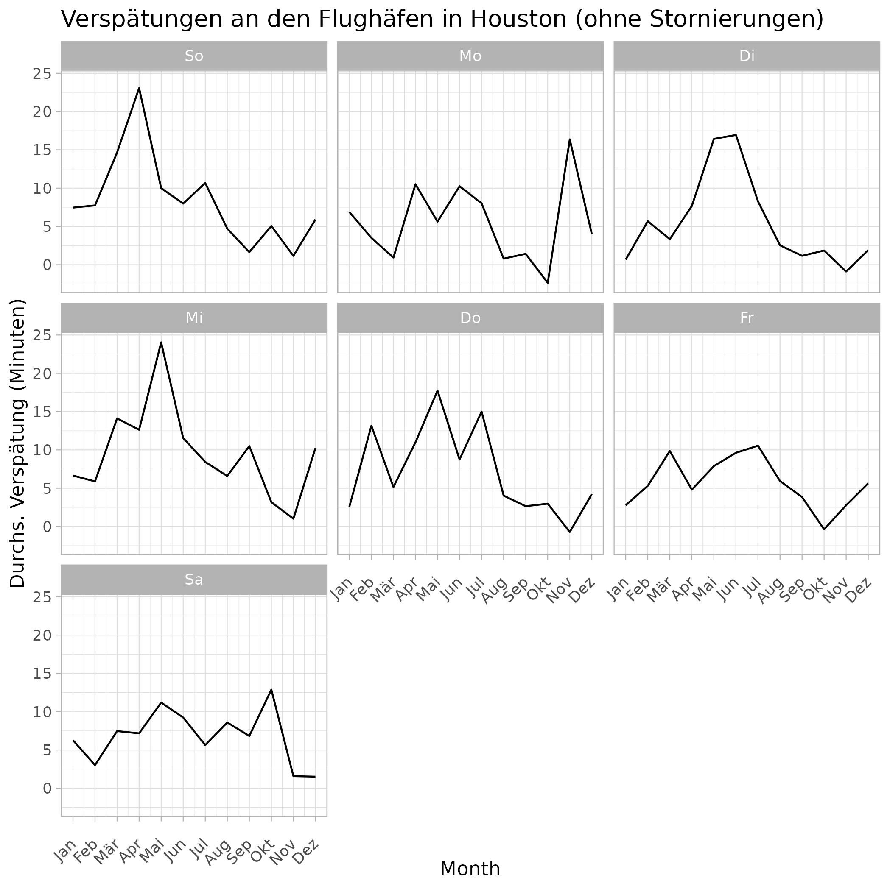

Mock exam 1
================

## Frage 1: Reproduce graph (15P)

- Reproduzieren Sie die Grafik “Q1plot.png” in Ihrem Repository so genau
  wie möglich.
- Verwenden Sie bei Bedarf die `tidyverse`-Pakete zum Preprocessen und
  verwenden Sie `ggplot2` zum Plotten.
- Außerdem kann es hilfreich sein das Paket `lubridate` zu verwenden.
- Verwenden Sie die `hflights` Daten aus dem `hflights` Paket
  (`data("hflights")`).
- Für diese Aufgabe sind keine automatisierten Tests vorgesehen.
- Die durchschnittliche Verspätung wird als `mean` über alle existenten
  `ArrDealay`s gebildet.
- Als Datengrundlage dient der Datensatz `hflights`, der alle Abflüge an
  den Flughäfen in Houston über einen gewissen Zeitraum abbildet.
- Abgebildet in den einzelnen Subplots sind diese Mittelwerte pro Monat.
- Etwaige Filter und Datentransformationen müssen Sie aus dem Plot
  ableiten.
- Eine Reproduktion in Englischer Sprache ist zulässig.

<figure>

<figcaption aria-hidden="true">Q1plot</figcaption>
</figure>

## Frage 2: Exchange money (15P)

- Schreiben Sie eine Funktion, die Euros in US-Dollars umrechnet und
  vice versa.
- Verwenden Sie den Wechselkurs vom 09.01.2024: 1 USD = 0,92 EUR als
  Standardwert.
- Achten Sie darauf, alle Argumente gründlich zu überprüfen.
- Nennen Sie die Funktion `ex02exchange_money`.
- Ihnen stehen die Tests “2.1”, “2.2” und “2.3” mit je mehreren
  Assertions zur Verfügung.

### Eingabe (erwartete Argumente)

- `value` Numerischer Vektor ohne fehlende Werte. Der Geldbetrag, der
  gewechselt wird
- `currency`: Character Skalar. Die Ausgangswährung, muss entweder “EUR”
  oder “USD” annehmen. Per Default: “USD”
- `eur_per_usd`: Numerischer Skalar (\>0). Der Wechselkurs, zu dem
  gewechselt wird. Per Default: 0.92

### Ausgabe

- `numeric(n)`

### Beispiele

``` r
#ex02exchange_money(0.8)
#> [1] 0.736
#ex02exchange_money(0.8, "USD", 0.92)
#> [1] 0.736
#ex02exchange_money(2.44, "EUR", 0.92)
#> [1] 2.652174
#ex02exchange_money(0.8, "USD", 0.89)
#> [1] 0.712
#ex02exchange_money(1:4, "USD", 0.89)
#> [1] 0.89 1.78 2.67 3.56
#ex02exchange_money(c(1:4, NA), "USD", 0.89)
#> [1] 0.89 1.78 2.67 3.56   NA
#ex02exchange_money(c("Eins", 3, 3.1), "USD", 0.89)
#> Error in ex02exchange_money(c("Eins", 3, 3.1), "USD", 0.89) :
#>  Assertion on 'value' failed: Must be of type 'numeric', not 'character'.
#ex02exchange_money(1:4, "CAD", 0.89)
#> Error in match.arg(currency, c("USD", "EUR")) :
#>   'arg' should be one of “USD”, “EUR”
```

### Ihre Funktion

``` r
#' Currency conversion between EUR and USD
#' This function coverts EUR to USD and vice versa.
#' The exchange rate can be supplied manually but defaults to
#' 1 USD = 0.92 EUR
#' Arguments:
#' value: temperature in Fahrenheit or Celsius. A numeric vector.
#' currency: the currency that value is in. Must be "USD" for US Dollars or
#'           "EUR" for Euros.
#' eur_per_usd: The exchange rate EUR/USD, a numeric scaler.
#' Returns: a numeric vector indicating the temperature in Celsius.
ex02exchange_money <- function(value, currency = "USD", 
                               eur_per_usd = 0.92) {
#TODO
}
```

## Frage 3 - hflights (30P)

Betrachten Sie den Datensatz “hflights” aus dem Paket `hflights`.

``` r
library(hflights)
library(tidyverse)
data("hflights")
summary(hflights)
```

    ##       Year          Month          DayofMonth      DayOfWeek        DepTime    
    ##  Min.   :2011   Min.   : 1.000   Min.   : 1.00   Min.   :1.000   Min.   :   1  
    ##  1st Qu.:2011   1st Qu.: 4.000   1st Qu.: 8.00   1st Qu.:2.000   1st Qu.:1021  
    ##  Median :2011   Median : 7.000   Median :16.00   Median :4.000   Median :1416  
    ##  Mean   :2011   Mean   : 6.514   Mean   :15.74   Mean   :3.948   Mean   :1396  
    ##  3rd Qu.:2011   3rd Qu.: 9.000   3rd Qu.:23.00   3rd Qu.:6.000   3rd Qu.:1801  
    ##  Max.   :2011   Max.   :12.000   Max.   :31.00   Max.   :7.000   Max.   :2400  
    ##                                                                  NA's   :2905  
    ##     ArrTime     UniqueCarrier        FlightNum      TailNum         
    ##  Min.   :   1   Length:227496      Min.   :   1   Length:227496     
    ##  1st Qu.:1215   Class :character   1st Qu.: 855   Class :character  
    ##  Median :1617   Mode  :character   Median :1696   Mode  :character  
    ##  Mean   :1578                      Mean   :1962                     
    ##  3rd Qu.:1953                      3rd Qu.:2755                     
    ##  Max.   :2400                      Max.   :7290                     
    ##  NA's   :3066                                                       
    ##  ActualElapsedTime    AirTime         ArrDelay          DepDelay      
    ##  Min.   : 34.0     Min.   : 11.0   Min.   :-70.000   Min.   :-33.000  
    ##  1st Qu.: 77.0     1st Qu.: 58.0   1st Qu.: -8.000   1st Qu.: -3.000  
    ##  Median :128.0     Median :107.0   Median :  0.000   Median :  0.000  
    ##  Mean   :129.3     Mean   :108.1   Mean   :  7.094   Mean   :  9.445  
    ##  3rd Qu.:165.0     3rd Qu.:141.0   3rd Qu.: 11.000   3rd Qu.:  9.000  
    ##  Max.   :575.0     Max.   :549.0   Max.   :978.000   Max.   :981.000  
    ##  NA's   :3622      NA's   :3622    NA's   :3622      NA's   :2905     
    ##     Origin              Dest              Distance          TaxiIn       
    ##  Length:227496      Length:227496      Min.   :  79.0   Min.   :  1.000  
    ##  Class :character   Class :character   1st Qu.: 376.0   1st Qu.:  4.000  
    ##  Mode  :character   Mode  :character   Median : 809.0   Median :  5.000  
    ##                                        Mean   : 787.8   Mean   :  6.099  
    ##                                        3rd Qu.:1042.0   3rd Qu.:  7.000  
    ##                                        Max.   :3904.0   Max.   :165.000  
    ##                                                         NA's   :3066     
    ##     TaxiOut         Cancelled       CancellationCode      Diverted       
    ##  Min.   :  1.00   Min.   :0.00000   Length:227496      Min.   :0.000000  
    ##  1st Qu.: 10.00   1st Qu.:0.00000   Class :character   1st Qu.:0.000000  
    ##  Median : 14.00   Median :0.00000   Mode  :character   Median :0.000000  
    ##  Mean   : 15.09   Mean   :0.01307                      Mean   :0.002853  
    ##  3rd Qu.: 18.00   3rd Qu.:0.00000                      3rd Qu.:0.000000  
    ##  Max.   :163.00   Max.   :1.00000                      Max.   :1.000000  
    ##  NA's   :2947

Es ist Ihre Aufgabe den Datensatz gemäß der Vorgaben in den Teilaufgaben
zu analysieren. Sie können Ihren Ansatz mit jeweiligen Tests überprüfen.
Da Sie aber keine Funktionen schreiben, sind die Tests eher binär. Die
Tests werden grün, wenn Sie die Aufgabe so gelöst haben, wie die
Musterlösung es erwartet. Für die Tests ist es wichtig, dass Sie die
jeweiligen Objekte korrekt bezeichnen. Für reverse engineerte Tests ohne
Code erhalten Sie Null Punkte. Die Tests sind immer gleich aufgebaut:
Zunächst wird überprüft, ob Ihre Lösung das richtige Format hat (z.B
data.frame mit 10 Zeilen und 3 Spalten inkl. Spaltennamen). Dann werden
Statistiken Ihres Objektes (z.B. Median einer speziellen Spalte)
getestet. Im Umkehrschluss bedeutet das, dass, wenn erst die Assertions
bzgl. der Statistiken Fehler produzieren, die Format Checks bereits
durchgelaufen sind.

### a)

Wandeln Sie alle Spalten der Klasse `character` in eine Spalte der
Klasse `factor` um. Speichern Sie das Ergebnis in “ex0302a”. Arbeiten
Sie anschließend mit diesem Datensatz weiter. Für diese Teilaufgabe
steht Ihnen der Test “3.1” zur Verfügung.

``` r
ex0302a <- NULL
```

### b)

Filtern Sie nach allen Flügen, die annulliert (“cancelled”) wurden.
Welche Fluggesellschaft hat die meisten Annullierungen? Beantworten Sie
diese Frage mit einem `data.frame`, das für jeden `UniqueCarrier`
(Spalte 1) eine Anzahl `n` (Spalte 2) der Annullierungen enthält und
sortieren Sie es in absteigender Reihenfolge nach `n`. Speichern Sie das
Resultat als `ex0302b`. Für diese Teilaufgabe steht Ihnen der Test “3.2”
zur Verfügung.

``` r
ex0302b <- NULL
```

### c)

Anstelle von absoluten Werten interessiert uns ein Annulierungs-Ratio
pro Carrier. Berechnen Sie diesen Ratio und geben Sie ihn in einem
`data.frame` mit zwei Spalten (`UniqueCarrier` und `CancellationRatio`)
aus. Sortieren Sie ihn so, dass die höchsten Ratios zuerst erscheinen.
Runden Sie auf 4 Ziffern. Speichern Sie das Resultat als `ex0302c`. Für
diese Teilaufgabe steht Ihnen der Test “3.3” zur Verfügung.

``` r
ex0302c <- NULL
```

### d)

Als zweite Kennzahl interessiert uns die durchschnittliche Verzögerung
(`MeanDelay`) bei der Ankunft (`ArrDelay`). Berechnen Sie diese Kennzahl
pro Fluggesselschaft (`Unique Carrier`). Achten Sie darauf, dass bei der
Berechnung der Verspätung (`ArrDelay`), nur positive Werte für die
Berechnung verwendet werden (eine negative Verspätung ist mit einer
frühen Ankunft verbunden), grundsätzlich aber alle Daten verwendet
werden. Runden Sie die Werte wie zuvor auf 4 Ziffern. Speichern Sie das
resultierende `data.frame` mit zwei Spalten als `ex0302d`. Für diese
Teilaufgabe steht Ihnen der Test “3.4” zur Verfügung.

``` r
ex0302d <- NULL
```

### e)

Ermitteln Sie die Anzahl der Flüge, die mit Verspätung gestartet sind
(`DepDelay`), aber ohne Verspätung landen konnten (`ArrDelay`).
Speichern Sie das Resultat als `ex0302e`. Für diese Teilaufgabe steht
Ihnen der Test “3.5” zur Verfügung.

``` r
ex0302e <- NULL
```

## Frage 4 - Runner (30P)

Sie implementieren das Spiel “Runner”. Sie spielen das Spiel mit einem
Kartendeck aus vier Farben (“rot”, “blau”, “grün”, “gelb”), die jeweils
Karten mit Zahlen von eins bis 13 enthalten. Das Spiel kann mit einem
Geber (“Dealer”) und einem bis fünf Spielern gespielt werden. Das Spiel
beginnt, wenn der Geber eine Karte vom Stapel zieht. Er fragt den ersten
Spieler, ob die aktuelle Karte eine höhere, niedrigere oder gleiche Zahl
als die vorherige Karte hat. Der Spieler erhält 1 Punkt, wenn er richtig
liegt, und 1 Minuspunkt, wenn er falsch liegt. Die Karte, die der
vorherige Spieler erraten musste, ist nun die Karte, die der nächste
Spieler erraten muss. Das Spiel geht weiter, bis keine Karte mehr im
Stapel ist. Ihre Funktionen werden automatisiert getestet. Die Objekte,
die Sie in a) und b) erstellen können Sie auch testen. Fehlermeldungen
aus den Beispielen müssen Sie nicht exakt replizieren. Diese geben aber
Aufschluss darüber, was Sie abfangen müssen.

### a)

Erstellen Sie einen `data.frame`, das als Datenbasis dient, um alle 52
Karten im Deck anzuzeigen, so dass jede Karte eindeutig identifiziert
werden kann. Nennen Sie das `data.frame` “ex04adeck”. Nennen Sie die
Spalten “colour” und “number”.

``` r
ex04adeck <- NULL
```

### b)

Dies ist Ihr Starter Deck. Aus technischen Gründen müssen wir auch die
aktuelle Karte und die Historie der Karten festhalten. Dieser Slot wird
zunächst aber leer bleiben. Erstellen Sie eine Liste namens “ex04bdeck”,
die diese Einträge mit den Namen “card”, “deck” und “history” enthält.
Da wir noch nicht gespielt haben, sollten “card” und “history” leer
sein. Das Element deck soll das in der Voraufgabe erstellte Deck
enthalten.

``` r
ex04bdeck <- NULL
```

### c)

Implementieren Sie ein Ziehen aus dem Deck als eine `R` Funktion. Ihre
Funktion sollte eine benannte Liste zurückgeben, bei der der erste
Eintrag die Reihe ist, die aus dem Deck gezogen wurde, und der zweite
Eintrag das verbleibende Deck ohne die gezogene Karte ist. Der Verlauf
(history) entspricht allen Karten, die aus dem Deck gezogen wurden, in
chronologischer (absteigender) Reihenfolge. Alle Einträge sollten,
sofern nicht leer, den gleichen Typ/die gleiche Klasse haben. Die
Einträge sollten “card” und “deck”, “history” genannt werden. Ignorieren
Sie zunächst die “history” und erfassen Sie diese im Ziehen nicht.
Nennen Sie die Funktion `ex04draw`. Sie benutzt das “Deck” als Eingabe
und hat ein optionales Startargument. Die Eingabe “deck” sollte das
gleiche Format haben wie die Ausgabe. Stellen Sie sicher, dass der Seed
nur gesetzt wird, wenn er angegeben wird, so dass die Funktion
standardmäßig zufällig arbeitet. Verwenden Sie die bereitgestellte
Signatur. Ihnen stehen die Tests “4.31”, “4.32” und “4.33” zur
Verfügung.

#### Eingabe

- `deck`: Eine Liste, die den Anforderungen für ein Deck aus b)
  entspricht.
- `seed`: Numerisches Skalar. Der Seed für das Generieren von
  Zufallszahlen.

#### Ausgabe

- Ein `deck`, mit einer Karte weniger in `$deck` im Vergleich zum Input.
- Die entfernte Karte wird in `$card` als ein `data.frame` mit einer
  Zeile dargestellt.

#### Beispiele

``` r
example_deck <- list(
  card = NULL,
  deck = data.frame(colour = c("black", "orange", "white", "black"),
                    number = c(8, 9, 1, 3)),
  history = NULL)
#it does not matter which card is actually transferred
ex04draw(example_deck, seed = 8L)
```

    ## $card
    ##   colour number
    ## 4  black      3
    ## 
    ## $deck
    ##   colour number
    ## 1  black      8
    ## 2 orange      9
    ## 3  white      1
    ## 
    ## $history
    ## NULL

``` r
example_deck <- list(
  card = NULL,
  deck = data.frame(colour = c("black", "orange", "white", "black"),
                    number = c(8, 9, 1, 3),
                    irrelevant = c("A", "A", "C", "D")),
  history = NULL)
ex04draw(example_deck, seed = 8L)
```

    ## $card
    ##   colour number irrelevant
    ## 4  black      3          D
    ## 
    ## $deck
    ##   colour number irrelevant
    ## 1  black      8          A
    ## 2 orange      9          A
    ## 3  white      1          C
    ## 
    ## $history
    ## NULL

``` r
example_deck <- list(
  card = data.frame(colour = "green", number = 12),
  deck = data.frame(colour = c("black", "orange", "white", "black"),
                    number = c(8, 9, 1, 3)),
  history = NULL)
ex04draw(example_deck, seed = 8L)
```

    ## $card
    ##   colour number
    ## 4  black      3
    ## 
    ## $deck
    ##   colour number
    ## 1  black      8
    ## 2 orange      9
    ## 3  white      1
    ## 
    ## $history
    ## NULL

#### Ihre Funktion

``` r
ex04draw <- function(deck, seed = NULL) {
#TODO
}
```

### d)

Implementieren Sie die Entscheidung eines spielenden Individuums, das
seine Entscheidung auf die vorherige (vor Beginn des Spiels) Verteilung
der Zahlen stützt, d.h. das Individuum wird immer “größer” spielen, wenn
eine Zahl kleiner als 7 erscheint und “kleiner”, wenn sie größer ist. Im
Falle von 7 ist die Person unentschieden und trifft eine zufällige
Entscheidung zwischen den gleich wahrscheinlichen Ereignissen (aus ihrer
Sicht). Die Funktion nimmt die `card` (die Karte, über die entschieden
werden soll) und das `deck` (das verbleibende Deck zum Zeitpunkt der
Entscheidung) als Eingaben. Nennen Sie die Funktion `ex04decide_prior`.
Die Funktion gibt einen skalaren Zeichenwert aus: “larger”, “equal” oder
smaller” (die getroffene Entscheidung). Verwenden Sie die
bereitgestellte Signatur. Ihnen stehen die Tests “4.41”, “4.42” und
“4.43” zur Verfügung.

#### Eingabe

- `card`: Ein `data.frame` mit einer Zeile und (mindestens) den zwei
  Spalten `colour` und `number`
- `deck`: Ein `data.frame` mit beliebig vielen Zeilen und (mindestens)
  den zwei Spalten `colour` und `number`

#### Ausgabe

- Ein skalerer Character: entweder “smaller” oder “larger” gemäß der
  Angabe.

#### Beispiele

``` r
example_deck <- list(
 card = data.frame(colour = "green", number = 12),
 deck = data.frame(colour = c("black", "orange", "white", "black"),
                   number = c(8, 9, 1, 3)),
 history = NULL)
ex04decide_prior(card = example_deck$card, deck = example_deck$deck)
```

    ## [1] "smaller"

``` r
example_deck <- list(
 card = data.frame(colour = "green", number = 4),
 deck = data.frame(colour = c("black", "orange", "white", "black"),
                   number = c(8, 9, 1, 3)),
 history = NULL)
ex04decide_prior(card = example_deck$card, deck = example_deck$deck)
```

    ## [1] "larger"

#### Ihre Funktion

``` r
ex04decide_prior <- function(card, deck) {
  #TODO
}
```

### e)

Vervollständigen Sie die nachstehende Funktion “reward”, die die Punkte
für eine bestimmte Entscheidung (`decision`)und die Zahl, die Sie wählen
(`new_number`) , mit der Zahl der offenen Karte (`old_number`)
vergleicht. Ihnen stehen die Tests “4.51”, “4.52” und “4.53” zur
Verfügung.

#### Eingabe

- `decision`: Ein skalarer character, die Entscheidung, die vor dem Zug
  der neuen Karte getroffen wurde. Muss entweder “larger”, “smaller”
  oder “equal” sein.
- `new_number`: Ein skalarer Numeric, die Nummer der neu gezogenen Karte
- `old_number`: Ein skalerer Numeric, die Nummer der offenen Karte

#### Ausgabe

- `numeric(1)`, entweder -1 oder 1.

#### Beispiele

``` r
ex04reward("equal", 2, 6)
```

    ## [1] -1

``` r
ex04reward("equal", 5, 5)
```

    ## [1] 1

``` r
ex04reward("larger", 5, 6)
```

    ## [1] -1

``` r
ex04reward("smaller", 5, 6)
```

    ## [1] 1

``` r
ex04reward("larger", -5, 6)
```

    ## Error in ex04reward("larger", -5, 6): Assertion on 'new_number' failed: Element 1 is not >= 1.

``` r
ex04reward("larger", c(1, 1), 1)
```

    ## Error in ex04reward("larger", c(1, 1), 1): Assertion on 'new_number' failed: Must have length <= 1, but has length 2.

#### Ihre Funktion

``` r
ex04reward <- function(decision, new_number, old_number) {
  if (!decision %in% c("larger", "smaller", "equal")) {
    stop("decision must be one of larger, smaller, equal")
  }
  checkmate::assert_integerish(new_number, lower = 1L, max.len = 1L)
  checkmate::assert_integerish(old_number, lower = 1L, max.len = 1L)
  if (decision == "larger") {
    if (new_number > old_number) {
      points <- 1
    } else {
      points <- -1
    }
  }
  #TODO
}
```
