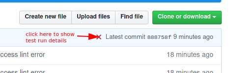
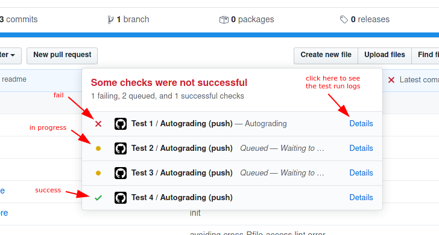

# Programming in R

## General Information
 
### Setup

1. *Clone* this repository to your own computer.

   Since you are reading this you already have your own copy of the homework in your own *GitHub* account. First you have to *clone* this repository to your own computer, probably using a command that starts with `git clone ...`, or using RStudio or any other GUI. Since you would have to enter your *GitHub* password every time you pull or push things from this repository, it would be useful to set up an SSH-key, as [the material from the first homework task](https://github.com/PROGR-2021/01_git/#information-material) explained.
2. Open the project in RStudio. The first thing you should execute, before doing anything else, is **`renv::restore()`**. If `renv` asks you any questions it is a good idea to accept the defaults. This will install the packages you need to run the tests correctly on your own computer. If you are a Mac-User, you may get the message `xrun: error: invalid active developer path` or similar. In that case, look at the solution posted [here](https://apple.stackexchange.com/questions/254380/why-am-i-getting-an-invalid-active-developer-path-when-attempting-to-use-git-a) and then run `renv::restore()` again.

  Restart your R-session, then you *don't* have to load any packages (`checkmate`, `data.table`, `R6`, and `ggplot2`).


### Work on the Problems

3. Look at the `.R`-files in the `R/`-directory. They are sorted by increasing difficulty and subdivided into different topics they cover, giving you a hint about where in the material you should look to find guidance. In each file you will find empty functions, each with a heading in the way of *"Write a function that does X"*. Fill the body of the function (i.e. the part between the curly braces `{ }`) with code that does what is asked for. Example

     ```r
     # write a function that divides x by y
     ex01Divide <- function(x, y) {
       # your code
     }
     ```

    should become

    ```r
    # write a function that divides x by y
    ex01Divide <- function(x, y) {
      x / y
    }
    ```

    (remember that the function always returns the result of the last command executed in it.)

    In this Course, we are not making use of any libraries besides `checkmate`, `data.table`, `R6`, and `ggplot2`, and what comes with `R` by default. **The libraries are loaded automatically, so don't `library()` them in your code** (after `renv::restore()` you may have to restart your R-session to get access to them, see above). Please don't use `require(`, `library(`, or `::` / `:::` or anything else that loads other libraries, and don't install further packages for this task. Furthermore, this is an `R` course, so don't run any external software from your code.

    Remember that we are also checking **code style**. Refer to [our Guide to Programming Style](ProgR_00_Programming_Style.pdf) for information.
	
	We are going to verify you are using `checkmate`. **E.g. when the task tells you to expect a single positive integer, you have to `assertInt(x, lower = 1)` or `assertCount(x, positive = TRUE)` your function argument.** (For `data.table` arguments, only `assertDataTable(<argument>)` is necessary).

    You don't need to write tests in `tests/` and the content is not going to be graded (but you are invited to do this for your own sake).

4. Work gradually towards a solution. I personally find it useful to work with a working script where I try out different functions on different inputs to see how they work in particular cases, and how they may work together. An example of what that may look like is the `working_notebook.Rmd` file that you can open in RStudio and look at. You may of course use any style you prefer.

### Check your Result Frequently

5. You can run the `evaluate_submission.R` script with

    ```sh
    Rscript evaluate_submission.R
    ```

    to check *all* results, but you can also do

    ```sh
    Rscript evaluate_submission.R --skip-style
    ```

    to skip the style-test. Use

    ```sh
    Rscript evaluate_submission.R --exercise=1
    ```

    to only evaluate a single exercise. You can also test sub-exercises `--exercise=1.1` and combine different `--exercise`-arguments as well as the `--skip-style` argument. For example,

    ```sh
    Rscript evaluate_submission.R --exercise=1 --exercise=2.1 --skip-style
    ```

    checks all of exercise 01, and task ex01 of exercise 02 and skips style checks. When `--exercise=` arguments are given and style checks are not skipped, then only the style of the `R`-files containing the requested exercise are checked. Notice, that selecting single exercises to evaluate often results in a more detailed error description!

    You can open `evaluation_notebook.Rmd` and run the evaluation from there. See the notebook on how to restrict checks to certain exercises.

    Reminder: to make sure that you run the same grading tool that we will use, **it is important that you don't change the `evaluate_submission.R` file, and that you don't change the content of the `.github` folder!** If you edit these files it is possible that your submission contains errors but that the script won't show them to you. If you should edit these folders accidentally, you will have to use `git` to go back in history to restore them.

6. Whenever you upload your progress to *GitHub* using `git push`, an *automatic test* is started. There are four indicators at the top of this text, showing the status of each of the four `.R`-file checks. There is a small status indicator at the right upper corner of the file listing of this repository. If you want to see the status of your tests, you can click it:

    
	
	And click to "Details" on the menu that opens
	
    	

7. Commit and push your work often! It is good practice to break the changes you make to files into small chunks, so if you make a mistake in one of your commits you can "revert" it without touching other changes. If you push often you also get the benefit of getting frequent feedback about the status of your submissions.

### Hand in Your Solution

8. This happens automatically as soon as you push back to *GitHub*, so you don't have to go any further! Basically, for each badge at the top of this document which is green, you get 0.25 points. Note: this is only true if you **did not modify `evaluate_submission.R` and did not modify the `.github` folder**. 

### A Note on Clever Solutions

If your solution deviates from the given task but the test fails to notice that and still passes, then you will get full credit. You are invited to have fun, be creative and hand in solutions involving interesting ways to go against the spirit of the tests, while still passing them -- an important skill in programming. However, please don't try to defeat the test procedure itself (e.g. by embedding code in your functions that breaks the test procedure or quitting the R process returning a no-error-status) or we may refuse the exam credit on this task. 

It should furthermore go without saying that you absolutely must not include any code that is intended to damage, or modify in an unexpected way, the system on which it is being run.
